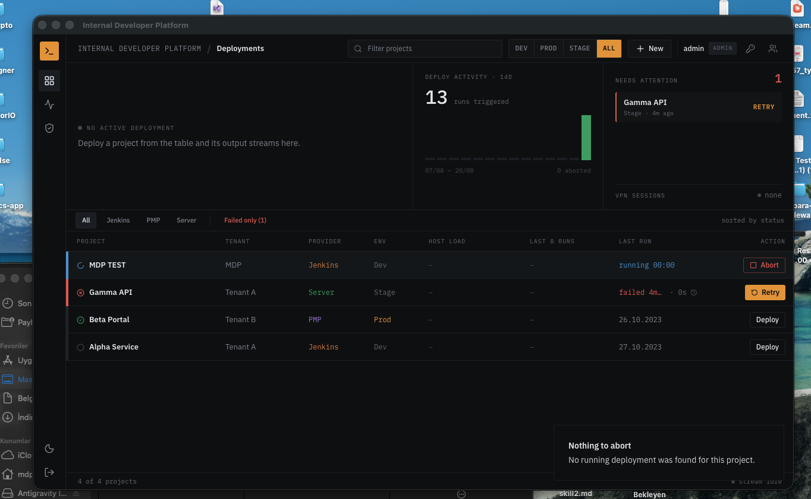
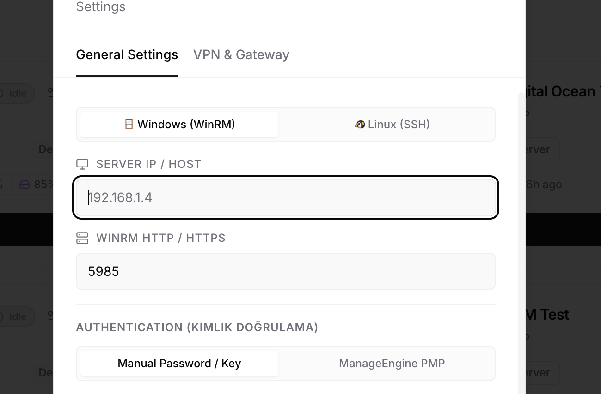
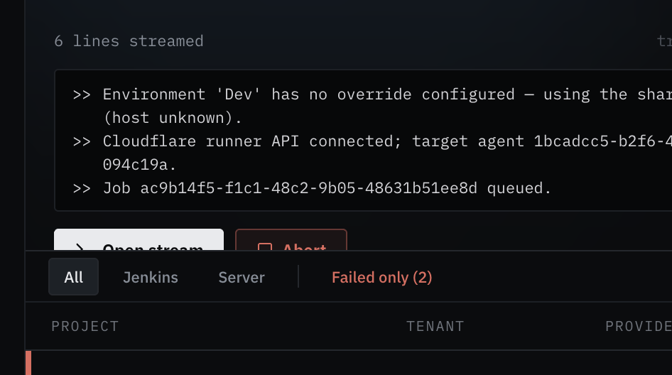
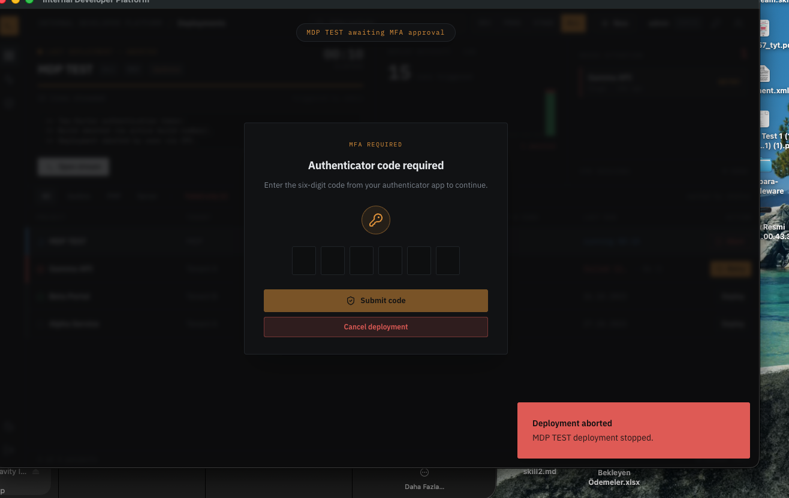
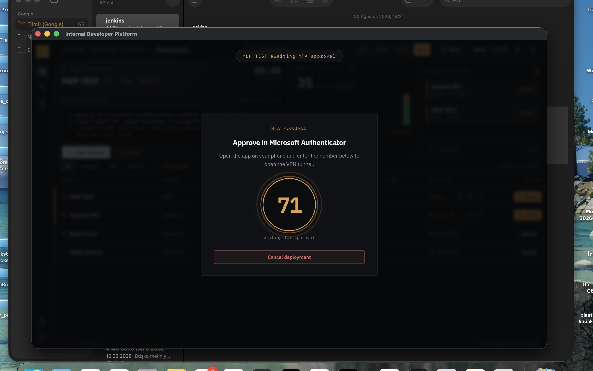
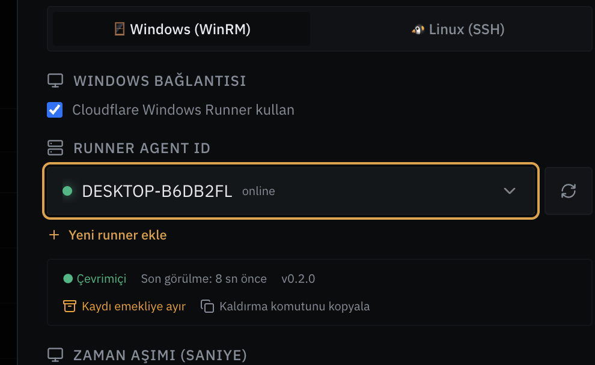
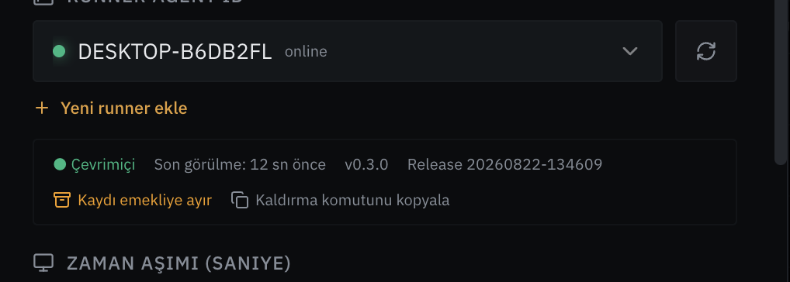
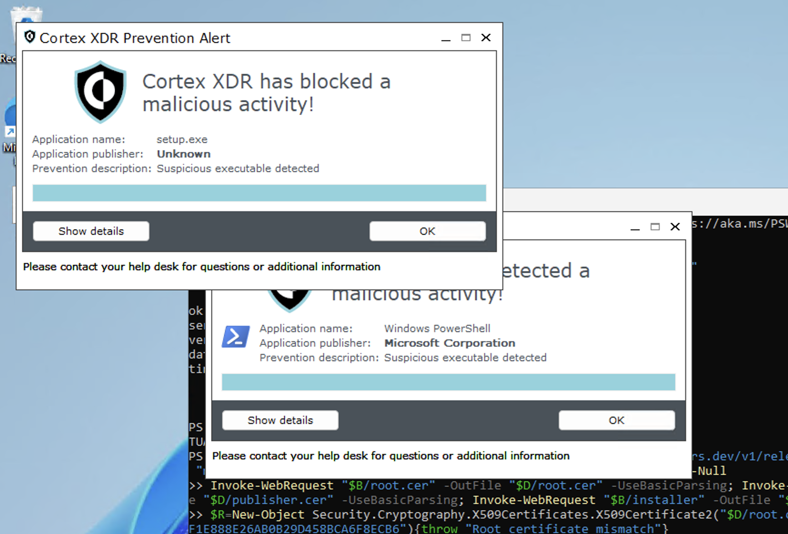

# IDP Kullanma ve Teknik İşletim Kılavuzu

> **Ürün:** Internal Developer Platform (IDP)  
> **Kuruluş:** MDP Group  
> **Belge sürümü:** 1.0  
> **Son güncelleme:** 22 Ağustos 2026  
> **Proje durumu:** Askıya alınmış; yeniden başlatılırken “Bilinen sınırlamalar” bölümü gözden geçirilmelidir.

Bu belge IDP’yi kullanan operatörler, proje yöneticileri, Windows Runner yöneticileri ve ürünü devralacak geliştiriciler için tek başlangıç noktasıdır. Komut örneklerinde gerçek parola, API anahtarı, enrollment tokenı veya özel anahtar bulunmaz.

---

## İçindekiler

1. [Amaç ve kapsam](#1-amaç-ve-kapsam)
2. [Mimari ve veri akışı](#2-mimari-ve-veri-akışı)
3. [Roller ve yetkiler](#3-roller-ve-yetkiler)
4. [Masaüstü uygulamasını çalıştırma](#4-masaüstü-uygulamasını-çalıştırma)
5. [Arayüz ve temel kullanım](#5-arayüz-ve-temel-kullanım)
6. [Proje oluşturma ve yapılandırma](#6-proje-oluşturma-ve-yapılandırma)
7. [Deployment çalıştırma](#7-deployment-çalıştırma)
8. [VPN ve MFA akışları](#8-vpn-ve-mfa-akışları)
9. [Windows Cloudflare Runner](#9-windows-cloudflare-runner)
10. [Runner release, yükseltme ve rollback](#10-runner-release-yükseltme-ve-rollback)
11. [Proje ve runner import/export](#11-proje-ve-runner-importexport)
12. [Runner kaldırma](#12-runner-kaldırma)
13. [Güvenlik ve müşteri ortamları](#13-güvenlik-ve-müşteri-ortamları)
14. [Sorun giderme](#14-sorun-giderme)
15. [Geliştirme, test ve paketleme](#15-geliştirme-test-ve-paketleme)
16. [Yedekleme ve felaket kurtarma](#16-yedekleme-ve-felaket-kurtarma)
17. [Bilinen sınırlamalar ve yeniden başlatma listesi](#17-bilinen-sınırlamalar-ve-yeniden-başlatma-listesi)

---

## 1. Amaç ve kapsam

IDP, farklı müşterilerdeki Jenkins, Linux/SSH, Windows/WinRM ve Windows Cloudflare Runner hedeflerine tek arayüzden deployment başlatmak için geliştirilmiştir. VPN bağlantısı, MFA, vault erişimi, canlı log, deployment geçmişi ve rol tabanlı yetkilendirme aynı akışta yönetilir.

Desteklenen ana yollar:

| Hedef | Bağlantı | Kullanım |
|---|---|---|
| Jenkins | HTTP(S) API | Parametreli build tetikleme ve progressive log |
| Linux sunucu | SSH | Script çalıştırma ve stdout/stderr toplama |
| Windows sunucu | WinRM | PowerShell çalıştırma |
| İzole Windows sunucu | Cloudflare Runner | Sunucudan dışarı doğru HTTPS polling ile imzalı job çalıştırma |
| ManageEngine PMP | API/vault veya tanımlı adımlar | Çalışma anında kimlik bilgisi alma |

> **Tercih sırası:** Müşteri politikası izin veriyorsa önce mevcut WinRM/SSH altyapısını kullanın. Cloudflare Runner, doğrudan erişimin mümkün olmadığı durumlar içindir ve müşteri güvenlik ekibinin standart yazılım onayını gerektirebilir.

---

## 2. Mimari ve veri akışı

```text
┌─────────────────────────────┐
│ IDP Electron / Web UI       │
│ Proje, deploy, log, MFA     │
└──────────────┬──────────────┘
               │ IPC (Desktop) / HTTP+SSE (Web)
┌──────────────▼──────────────┐
│ Backend Core                │
│ Auth · RBAC · SQLite        │
│ Deployment Manager         │
└──────┬────────┬────────┬────┘
       │        │        │
   Jenkins     SSH     WinRM/PMP
       │
       └──────────────────────────────┐
                                      │ HTTPS
                         ┌────────────▼─────────────┐
                         │ Cloudflare Worker + D1  │
                         │ Agent, job, log, release│
                         └────────────┬─────────────┘
                                      │ outbound HTTPS polling
                         ┌────────────▼─────────────┐
                         │ Windows IDP Runner       │
                         │ Limited service account │
                         │ Signed PowerShell jobs  │
                         └──────────────────────────┘
```

### 2.1 Desktop veri konumu

macOS paketli uygulama çalışma verisini şurada tutar:

```text
~/Library/Application Support/idp-desktop/
```

| Dosya | İçerik |
|---|---|
| `idp.env` | Uygulama ayarları; gizli değer içerir, git’e eklenmez |
| `idp.db` | Projeler, deployment geçmişi ve denetim kayıtları |
| `users.json` | Kullanıcı hesapları ve scrypt parola hash’leri |
| `secrets.safestorage.json` | İşletim sistemi anahtarlığıyla şifrelenmiş proje sırları |

### 2.2 Windows Runner veri konumu

| Yol | İçerik |
|---|---|
| `C:\Program Files\IDP Runner\` | Runner kodu ve kurulum dosyaları |
| `C:\ProgramData\IDP Runner\agent.json` | Agent kimliği ve açık yapılandırma |
| `C:\ProgramData\IDP Runner\runner.log` | Bağlantı/job günlüğü |
| Windows Machine Key Store | Agent signing ve exchange özel anahtarları |
| Task Scheduler → `IDP Runner` | Sürekli çalışan görev |
| Yerel kullanıcı `idp-runner-svc` | Yönetici olmayan çalışma hesabı |

Özel agent anahtarları dışarı aktarılamaz biçimde makine kapsamında tutulur. Enrollment tokenı kalıcı dosyaya veya PowerShell geçmişine yazılmaz.

---

## 3. Roller ve yetkiler

| İşlem | Viewer | Deployer | Admin |
|---|:---:|:---:|:---:|
| Projeleri ve geçmişi görüntüleme | ✓ | ✓ | ✓ |
| Audit kayıtlarını görüntüleme | ✓ | ✓ | ✓ |
| Deployment başlatma/iptal | — | ✓ | ✓ |
| MFA gönderme | — | ✓ | ✓ |
| Proje oluşturma/düzenleme/silme | — | — | ✓ |
| Kullanıcı ve VPN oturumu yönetme | — | — | ✓ |
| Runner/release yönetimi | — | — | ✓ |

Tanımsız rol veya işlem **fail-closed** olarak reddedilir. Üretim deployment yetkisini yalnızca ihtiyacı olan kullanıcılara verin.

---

## 4. Masaüstü uygulamasını çalıştırma

### 4.1 Paketli uygulama

Son yerel paket çıktıları normalde `desktop/dist/` altındadır. macOS uygulaması imzalanmamış/notarize edilmemişse yalnızca kontrollü geliştirme makinesinde kullanılmalıdır. Müşteriye dağıtılmamalıdır.

Uygulamayı ilk çalıştırdıktan sonra şu dosya oluşturulur:

```text
~/Library/Application Support/idp-desktop/idp.env
```

Dosyayı değiştirdiğinizde uygulamayı tamamen kapatıp yeniden açın.

### 4.2 Geliştirme modu

Gereksinim: Node.js 24 ve npm.

```bash
cd frontend
npm ci
npm run dev
```

İkinci terminal:

```bash
cd desktop
npm ci
npm run dev
```

### 4.3 Web modu

```bash
# Terminal 1
cd backend
npm ci
npm run dev

# Terminal 2
cd frontend
npm ci
npm run dev
```

Web modu varsayılan olarak backend `3001`, Vite frontend `5173` portunu kullanır.

---

## 5. Arayüz ve temel kullanım

Ana ekran; proje filtresi, ortam seçimi, deployment aktivitesi, dikkat gerektiren işler, aktif VPN oturumları ve proje tablosunu birlikte gösterir.



> Görsel geliştirme/test verisi içerir. Güncel sürümde sol menüde ayrıca merkezi **Runner workspace** ve **Workspace transfer** ekranları bulunur.

Temel akış:

1. Kullanıcı adı ve parola ile giriş yapın.
2. Üst bölümden `DEV`, `STAGE`, `PROD` veya `ALL` filtresini seçin.
3. Projeyi arama kutusundan bulun.
4. Yeni proje için `+ New`; mevcut proje için ayar simgesini kullanın.
5. `Deploy` düğmesine basıp hedef environment’ı doğrulayın.
6. Prod işlemlerinde gösterilen doğrulama metnini eksiksiz girin.
7. VPN/MFA gerekiyorsa ekrandaki adımı tamamlayın.
8. `Open stream` ile canlı stdout/stderr akışını takip edin.
9. Başarı, hata veya iptal sonucunu geçmiş ekranından doğrulayın.

---

## 6. Proje oluşturma ve yapılandırma

### 6.1 Ortak alanlar

Her proje için en az şu alanları belirleyin:

- Proje adı
- Tenant/müşteri
- Varsayılan environment (`Dev`, `Stage`, `Prod`)
- Provider (`Jenkins`, `Server`, `PMP`)
- Bağlantı hedefi
- Kimlik doğrulama yöntemi
- Çalıştırılacak script veya pipeline bilgisi
- Gerekliyse VPN profili ve MFA tipi

Secret alanları kaydedildikten sonra arayüze geri döndürülmez; yalnızca “tanımlı” bilgisi gösterilir. Yeni değer girmediğiniz sürece mevcut secret korunur.

### 6.2 Jenkins

Önerilen alanlar:

- Jenkins base URL
- Job yolu/adı
- Kullanıcı adı
- API tokenı
- Build parametreleri
- TLS/kurumsal CA yapılandırması

Akış `buildWithParameters` çağrısı yapar, kuyruktan build numarasını çözer ve `logText/progressiveText` üzerinden logları ilerlemeli olarak alır.

### 6.3 Linux / SSH

Önerilen alanlar:

- Host ve port (`22` varsayılan)
- Kullanıcı
- SSH private key veya parola
- Beklenen host-key fingerprint
- Script içeriği ve timeout

İlk bağlantıda host key’i bilinçli olarak kaydedin. Daha sonraki fingerprint değişikliğinde deployment’ı durdurun ve sunucu yöneticisiyle doğrulayın.

### 6.4 Windows / WinRM

Windows hedefinde önce `Windows (WinRM)` seçilir. Cloudflare Runner kapalıysa doğrudan WinRM alanları kullanılır.



| Ayar | Tipik değer |
|---|---|
| HTTP port | `5985` |
| HTTPS port | `5986` |
| Kullanıcı | `DOMAIN\kullanici` veya yerel hesap |
| Transport | HTTP/HTTPS, tercihen HTTPS |
| Script | PowerShell içerik |

Üretimde sertifika doğrulamasını kapatmayın. Self-signed sertifika varsa müşteri kök CA’sını IDP makinesine güvenilir kök olarak ekleyin.

### 6.5 Cloudflare Windows Runner

`Cloudflare Windows Runner kullan` seçildiğinde host/parola yerine merkezi agent listesinden bir runner seçilir. Proje ayarlarında yalnızca seçim ve sağlık durumu bulunur; enrollment/release işlemleri merkezi **Runner workspace** ekranından yapılır.

---

## 7. Deployment çalıştırma

### 7.1 Normal deployment

1. Proje satırındaki `Deploy` düğmesine basın.
2. Environment ve özet bilgiyi kontrol edin.
3. Prod ise onay metnini girin.
4. Deployment’ı tetikleyin.
5. Üst canlı deployment alanında bağlantı ve job durumunu izleyin.
6. `Open stream` düğmesiyle tam konsolu açın.



Log kaynakları:

- `System`: IDP orkestrasyonu
- `Runner`: job kuyruğu ve runner durumu
- `Runner:stdout`: script standart çıktısı
- `Runner:stderr`: script hata çıktısı

Başarı için yalnızca ekrandaki yeşil mesajı değil, çalıştırılan uygulamanın beklenen sonucunu da kontrol edin.

### 7.2 İptal

`Abort` aktif deployment’a iptal isteği gönderir. Runner tarafında çalışan PowerShell process ağacı sonlandırılır ve job tipik olarak `130` exit code ile kapanır. İptal sonrası hedef uygulamanın yarım durumda kalıp kalmadığını ayrıca kontrol edin.

### 7.3 Exit code yorumlama

| Kod | Anlam |
|---:|---|
| `0` | Başarılı |
| `1` | Genel script/PowerShell hatası |
| `7` | Script tarafından bilinçli döndürülen hata örneği |
| `124` | Timeout |
| `130` | Kullanıcı/IDP tarafından iptal |

Uygulama özel exit code’ları ayrıca deployment script dokümanında tanımlanmalıdır.

---

## 8. VPN ve MFA akışları

IDP deployment öncesinde gerekiyorsa VPN tünelini açar; bağlantı veya MFA başarısızsa hedef komut çalıştırılmaz. İşlem sonunda `finally` aşamasında tünel kapatılmaya çalışılır.

### 8.1 TOTP

Authenticator uygulamasındaki altı haneli kodu arayüzdeki kutulara girin.



### 8.2 Number match / push

Ekranda gösterilen sayıyı Microsoft Authenticator uygulamasına girip isteği onaylayın.



### 8.3 SAML pencere akışı

Electron, sistem tarayıcısından ayrı ve kontrollü bir giriş penceresi açar. Kurumsal hesabınızla giriş yapın. Parolayı IDP formuna değil yalnızca kimlik sağlayıcının gerçek alan adına girin.

### 8.4 Otomatik SMS OTP

Masaüstü `idp.env` içinde `MFA_WEBHOOK_API_KEY` tanımlıysa yerel OTP dinleyicisi açılır. Anahtar yoksa özellik kapalıdır. Telefon yönlendiricisinin örnek gövdesi:

```json
{
  "apiKey": "<IDP_ENV_ICINDEKI_DEGER>",
  "text": "OTP kodunuz 123456"
}
```

Aynı anda birden fazla deployment kod bekliyorsa etiketsiz OTP reddedilir.

---

## 9. Windows Cloudflare Runner

### 9.1 Çalışma modeli

Runner, Windows sunucusundan Cloudflare Worker’a dışarı doğru HTTPS bağlantısı kurar. İnternetten Windows’a inbound port açılmaz. Agent düzenli heartbeat gönderir, kendisine atanmış job’ı alır, job imzasını doğrular, sınırlı kullanıcıyla çalıştırır ve logları geri yollar.

Canlı servis adresi:

```text
https://idp-runner-api.bariskoc-249.workers.dev
```

### 9.2 Merkezi Runner workspace

Sol menüdeki runner yönetim ekranı:

- Agent filosunu ve sağlık durumunu listeler.
- Son görülme süresini, runner sürümünü ve kurulu release’i gösterir.
- Yeni agent kurulum komutu hazırlar.
- Sekiz karakterli cihaz kodunu onaylar.
- Agent’ı emekliye ayırır.
- Aktif release’i ve geçmiş release’leri yönetir.
- Upgrade ve Build & Publish komutlarını üretir.

Proje ayarlarında runner yönetimi yapılmaz; yalnızca mevcut runner seçilir.





### 9.3 Yeni runner kurulumu

Ön koşullar:

- Desteklenen Windows Server/Windows sürümü
- Windows PowerShell 5.1
- Yerel yönetici yetkisi
- Worker adresine HTTPS çıkışı
- Müşteri EDR/uygulama kontrol onayı
- IDP’de aktif, imzalı runner release’i

Adımlar:

1. IDP’de **Runner workspace** ekranını açın.
2. Agent adı girin. Geçerli biçim: 3–64 karakter; harf, rakam, `.`, `_`, `-`.
3. `Kurulumu hazırla` düğmesine basın.
4. Oluşan komutu kopyalayın.
5. Hedef Windows’ta **PowerShell’i Yönetici olarak** açın.
6. Komutu çalıştırın. Komut önce root/publisher sertifikalarını indirir ve root thumbprint’ini doğrular; ardından sertifikaları güvenilir depolara ekler.
7. Installer indirilir; SHA-256 ve Authenticode signer thumbprint doğrulanır.
8. PowerShell’de gösterilen sekiz karakterli cihaz kodunu IDP’ye girip `Onayla` düğmesine basın.
9. İstenirse yerel `idp-runner-svc` servis hesabı parolasını güvenli şekilde girin.
10. Runner’ın listede `online` olduğunu ve release bilgisinin geldiğini doğrulayın.

> Kurulum komutunu elle yeniden yazmayın. Hash ve thumbprint değerleri release’e göre değiştiğinden komutu her zaman IDP’den üretin.

### 9.4 Windows doğrulama komutları

```powershell
Get-ScheduledTask -TaskName "IDP Runner" |
    Select-Object TaskName, State,
        @{Name='RunAs';Expression={$_.Principal.UserId}},
        @{Name='RunLevel';Expression={$_.Principal.RunLevel}}

Get-Content "C:\ProgramData\IDP Runner\runner.log" -Tail 20
```

Beklenen:

- Task `Running` veya poll aralarında `Ready`
- RunAs `idp-runner-svc`
- RunLevel `Limited`
- Logda `Connected; queue is empty.`

Yapılandırma özeti:

```powershell
$Config = Get-Content "C:\ProgramData\IDP Runner\agent.json" -Raw | ConvertFrom-Json
$Config | Select-Object agentId, agentName, apiBaseUrl, installedReleaseId, enrolledAt
```

### 9.5 Sağlık durumları

| Durum | Operasyon |
|---|---|
| Online | Deployment yapılabilir |
| Degraded | Ağ/gecikme incelenmeli; kritik prod işi başlatılmamalı |
| Offline | Deployment başlatmayın; task, log ve HTTPS çıkışını kontrol edin |

---

## 10. Runner release, yükseltme ve rollback

### 10.1 PKI bileşenleri

Runner release zincirinde iki sertifika kullanılır:

- MDP Group Private Root CA
- MDP Group Runner Publisher

22 Ağustos 2026 test ortamında kullanılan thumbprint’ler tarihsel referanstır:

```text
Root:      7773C207C03F1E888E26AB0B29D458BCA6F8ECB6
Publisher: F995D43C136CD3DA167E6FBA56057069B35A72EA
```

Bu değerleri yeni release için sabit varsaymayın; `/v1/releases/current` ve IDP ekranındaki güncel bilgilerle doğrulayın.

> Root özel anahtarı mevcut yedekte bulunmamaktadır. Publisher özel anahtarı yedeklenmiştir ve sertifika 2029’da sona erer. PKI yenileme planı yeniden geliştirme başlamadan hazırlanmalıdır.

### 10.2 Build & Publish

1. Runner workspace’te `Build & Publish başlat` seçeneğini kullanın.
2. Tek kullanımlık upload tokenı oluşturun.
3. Komutu signing makinesinde yönetici PowerShell ile çalıştırın.
4. Araç sorunca tokenı güvenli giriş olarak verin; tokenı komut satırına eklemeyin.
5. Araç bundle oluşturur, dosyaları publisher sertifikasıyla imzalar, installer üretir ve Worker’a yayınlar.
6. Dönen `ReleaseId`, `InstallerPath` ve `Sha256` değerlerini release kaydına alın.

İlgili kaynaklar:

```text
runner-cloud/windows/release/New-IDPPrivatePKI.ps1
runner-cloud/windows/release/New-IDPSignedRunnerBundle.ps1
runner-cloud/windows/release/New-IDPRunnerInstaller.ps1
runner-cloud/windows/release/Publish-IDPRunnerInstaller.ps1
runner-cloud/windows/release/Build-And-Publish-IDPRunner.ps1
```

### 10.3 Upgrade

Runner workspace kurulu release ile aktif release’i karşılaştırır. Güncelleme varsa `Upgrade komutunu kopyala`:

1. Installer’ı indirir.
2. SHA-256 doğrular.
3. Authenticode imzasını ve publisher thumbprint’ini doğrular.
4. `setup.exe --upgrade` çalıştırır.
5. Başarısızlıkta önceki sürümü geri yüklemeye çalışır.

Upgrade sonrası `agent.json → installedReleaseId`, task durumu ve `runner.log` kontrol edilmelidir.

### 10.4 Rollback

Release channel listesinden önceki release için `Aktifleştir / rollback` seçilir. Bu işlem sadece merkezi aktif release’i değiştirir; mevcut runner’ların ayrıca upgrade komutuyla hedef release’e geçirilmesi gerekir.

---

## 11. Proje ve runner import/export

Sol menüdeki **Workspace transfer** ekranı, ekip üyeleri arasında proje tanımlarını taşır.

### Export

1. `Export workspace` seçin.
2. `idp-workspace-YYYY-MM-DD.json` dosyasını güvenli ekip kanalında paylaşın.
3. Paket; proje yapılandırmalarını ve runner ad/ID referanslarını içerir.

### Import

1. `Import workspace` seçin.
2. Daha önce oluşturulan JSON paketini açın.
3. Aynı tenant + proje adına sahip kayıtlar atlanır.
4. Runnerlar ID yerine isim üzerinden yerel filoya eşlenir.
5. Eşleşmeyen runnerları proje ayarından manuel seçin.
6. Her projenin secret alanlarını yeniden girin ve bağlantı testi yapın.

### Güvenlik davranışı

Şu alanlar export edilmez:

- Parolalar ve passphrase’ler
- API/enrollment/upload tokenları
- Secret ve credential alanları
- Private key’ler
- `hasPassword`, `hasToken` gibi secret varlık bayrakları
- Runner cihaz özel anahtarları

Paket şeması:

```json
{
  "schema": "mdp.idp.workspace",
  "version": 1,
  "exportedAt": "2026-08-22T00:00:00.000Z",
  "runners": [{ "id": "<old-id>", "name": "WINDOWS-SERVER-01" }],
  "projects": []
}
```

---

## 12. Runner kaldırma

### 12.1 Normal kaldırma

Runner workspace’ten ilgili agent’ı önce **Emekliye ayırın**. Ardından IDP’nin güncel release için ürettiği kaldırma komutunu hedef Windows’ta yönetici PowerShell ile çalıştırın.

Installer `--uninstall` akışı şunları kaldırır:

- `IDP Runner` scheduled task
- Machine key store’daki ilgili iki agent anahtarı
- `C:\ProgramData\IDP Runner`
- `C:\Program Files\IDP Runner`
- `idp-runner-svc` yerel kullanıcısı
- Servis hesabına ait eski `Log on as a batch job` SID kaydı

Şunlar bilinçli olarak korunabilir:

- `C:\ProgramData\IDP Runner Removal Records` kaldırma makbuzu
- Ayrı bir signing makinesindeki `C:\ProgramData\IDP Signing`

### 12.2 Kaldırma doğrulaması

```powershell
[pscustomobject]@{
    TaskStillExists    = $null -ne (Get-ScheduledTask -TaskName "IDP Runner" -ErrorAction SilentlyContinue)
    UserStillExists    = $null -ne (Get-LocalUser -Name "idp-runner-svc" -ErrorAction SilentlyContinue)
    DataStillExists    = Test-Path "C:\ProgramData\IDP Runner"
    InstallStillExists = Test-Path "C:\Program Files\IDP Runner"
}
```

Tüm değerlerin `False` olması beklenir.

Batch logon kontrolü:

```powershell
$Policy = Join-Path $env:TEMP "idp-rights-check.inf"
secedit /export /cfg $Policy /areas USER_RIGHTS /quiet
Select-String -Path $Policy -Pattern '^SeBatchLogonRight'
Remove-Item $Policy -Force
```

Eski, silinmiş `idp-runner-svc` SID’si listede kalmamalıdır.

---

## 13. Güvenlik ve müşteri ortamları

### 13.1 EDR/antivirüs

Mevcut runner installer özel MDP PKI’sı ile imzalıdır. Windows imzayı doğrulayabilir; ancak Cortex XDR gibi EDR ürünleri özel yayıncıyı tanımayabilir ve PowerShell’in indirme + EXE çalıştırma zincirini davranışsal olarak engelleyebilir.



Bu durumda:

1. Tekrar tekrar çalıştırmayın.
2. Cortex’i kapatmayın.
3. `powershell.exe` için genel allowlist istemeyin.
4. `Show details` içinden alert ID, modül, dosya yolu, SHA-256 ve action bilgilerini alın.
5. Müşteri güvenlik ekibine yayıncı sertifikası veya yalnızca güncel installer hash’i için hedef sunucu grubuyla sınırlı onay gönderin.
6. Mümkünse müşterinin SCCM/Intune/GPO dağıtım kanalını kullanın.

EDR uyarısının oluşması olayın yönetim konsoluna kaydedildiği anlamına gelebilir. E-posta/SIEM bildirimi müşterinin forwarding politikasına bağlıdır.

### 13.2 Uzun vadeli dağıtım önerisi

Üretim için mevcut self-extracting EXE/PowerShell kurulumunun yerine:

- Standart MSI (ör. WiX)
- Genel güvenilir OV/EV veya bulut kod imzası
- SBOM
- Virüs/EDR tarama raporu
- Belgelenmiş port/domain listesi
- SCCM/Intune/GPO sessiz kurulum

hazırlanmalıdır. Genel güvenilir imza EDR’nin otomatik izin vereceğini garanti etmez, ancak `Unknown Publisher` sorununu ve onay yükünü azaltır.

### 13.3 Secret kuralları

- Admin API key, upload tokenı veya enrollment tokenını komuta gömmeyin.
- `Read-Host -AsSecureString` veya uygulama güvenli girişini kullanın.
- Tokenları sohbet, ticket ve ekran görüntüsünde paylaşmayın.
- Gerçek `.env`, `idp.env`, PFX ve private key dosyalarını git’e eklemeyin.
- Script içine PAT/API token gömmeyin; secret store referansı kullanın.
- Loglarda secret görünürse değeri derhal rotate edin.

### 13.4 Ağ izinleri

Runner için minimum gereksinim:

```text
Outbound TCP/443 → idp-runner-api.bariskoc-249.workers.dev
Inbound port     → Gerekmez
```

Proxy/TLS inspection varsa Worker sertifika zincirinin doğrulandığını ve istek gövdelerinin kurum politikasına uygun olduğunu müşteriyle teyit edin.

---

## 14. Sorun giderme

### 14.1 `running scripts is disabled`

İndirilen scripti doğrudan çağırmak yerine yalnızca o process için politika belirtin:

```powershell
powershell.exe -NoProfile -ExecutionPolicy Bypass -File "C:\tam\yol\script.ps1"
```

Makine veya kullanıcı execution policy’sini kalıcı olarak gevşetmeyin. İmzalı release akışı mümkün olduğunda `AllSigned` kullanır.

### 14.2 `agent_name_exists`

Aynı isimli aktif/eski agent merkezi veritabanında vardır. Runner workspace’te eski kaydı emekliye ayırın veya benzersiz agent adı kullanın. Makinedeki dosyaları silmek merkezi kaydı silmez.

### 14.3 `invalid_enrollment_token`

Token süresi dolmuş, daha önce kullanılmış veya yanlış kopyalanmıştır. Yeni enrollment akışını başlatın. Tokenı PowerShell geçmişine yazmayın; cihaz kodu onay akışını kullanın.

### 14.4 Task `Ready`, result `0x41306`

`0x41306`, görevin sonlandırıldığını/çalışma durumunun değiştiğini gösterebilir; tek başına runner hatası kanıtı değildir. Event Viewer ve `runner.log` birlikte incelenmelidir.

### 14.5 Task exit code `1`, `agent.json access denied`

Servis hesabının:

- `C:\ProgramData\IDP Runner`
- `agent.json`
- `job-signing-public.jwk`
- İlgili MachineKeys dosyaları

üzerindeki ACL’lerini kontrol edin. `agent.json` enrollment sırasında non-inheriting ACL aldığı için dosyaya ayrıca read grant gerekir. Geniş `Everyone:FullControl` vermeyin.

### 14.6 `#requires ... Administrator`

Runner’ın sürekli çalışan `idp-runner.ps1` dosyasında `#Requires -RunAsAdministrator` bulunmamalıdır. Kurulum, upgrade ve kaldırma scriptleri yönetici ister; runtime runner sınırlı hesapla çalışır.

### 14.7 Here-string hatası

PowerShell here-string kapatıcısı satırın başında olmalıdır:

```powershell
$Script = @'
Write-Output "OK"
'@
```

`'@` önünde boşluk bulunursa `WhitespaceBeforeHereStringFooter` oluşur.

### 14.8 Bash `curl --data ... \` komutu PowerShell’de hata veriyor

Bash satır devamı `\`, PowerShell sözdizimi değildir. IDP’nin ürettiği `Invoke-RestMethod`/`Invoke-WebRequest` komutunu kullanın. Komutları farklı shell’ler arasında doğrudan kopyalamayın.

### 14.9 Timeout (`124`)

- Scriptin gerçekten beklemede olup olmadığını kontrol edin.
- Alt process’in stdout/stderr pipe’ını açık bırakmadığından emin olun.
- Proje timeout değerini bilinçli artırın.
- Sonsuz bekleme yerine script içine aşama logları ve uygulama seviyesinde timeout ekleyin.

### 14.10 Runner çevrimdışı

```powershell
Get-ScheduledTask -TaskName "IDP Runner"
Get-Content "C:\ProgramData\IDP Runner\runner.log" -Tail 50
Test-NetConnection idp-runner-api.bariskoc-249.workers.dev -Port 443
```

Ayrıca sistem saati, proxy, DNS, TLS inspection ve servis hesabı kilidini kontrol edin.

### 14.11 Cortex engeli

Kurulumu tekrarlamayın veya dosyayı yeniden adlandırarak kaçınmaya çalışmayın. Alert ayrıntılarını güvenlik ekibine iletin ve kurulumun gerçekten yarım kalıp kalmadığını kontrol edin:

```powershell
[pscustomobject]@{
    TaskExists    = $null -ne (Get-ScheduledTask -TaskName "IDP Runner" -ErrorAction SilentlyContinue)
    UserExists    = $null -ne (Get-LocalUser -Name "idp-runner-svc" -ErrorAction SilentlyContinue)
    DataExists    = Test-Path "C:\ProgramData\IDP Runner"
    InstallExists = Test-Path "C:\Program Files\IDP Runner"
}
```

---

## 15. Geliştirme, test ve paketleme

### 15.1 Depo yapısı

```text
backend/       Node.js core, web API, adapterlar, SQLite, secret store
frontend/      React + TypeScript + Vite arayüz
desktop/       Electron main/preload, IPC ve paketleme
runner-cloud/  Cloudflare Worker, D1 migration ve Windows runner
docs/          Analiz, güvenlik, geliştirme ve dağıtım belgeleri
verify.sh      Birleşik doğrulama komutu
```

### 15.2 Tam doğrulama

```bash
./verify.sh
```

Güvenlik taramalarıyla:

```bash
./verify.sh --with-security
```

Elle karşılıkları:

```bash
cd backend
npm ci
npm run lint
npm test

cd ../frontend
npm ci
npm run typecheck
npm run lint
npm run build

cd ../desktop
npm ci
npm run check:syntax
npm run build

cd ../runner-cloud
npm ci
npm run typecheck
```

### 15.3 Cloudflare Worker geliştirme

```bash
cd runner-cloud
npm ci
npm run typecheck
npm run dev
```

Remote D1 migration ve deploy, doğru Cloudflare hesabı/Wrangler oturumu olmadan çalıştırılmamalıdır:

```bash
npm run db:migrate:remote
npm run deploy
```

Worker secretları Wrangler secret store’da tutulmalıdır; `wrangler.jsonc` veya git içindeki dosyalara yazılmamalıdır.

### 15.4 Masaüstü paketleme

```bash
cd frontend
npm run build

cd ../desktop
npm run build
```

İmzasız yerel paket test içindir. Üretim macOS dağıtımı için Developer ID + notarization; Windows dağıtımı için Authenticode gerekir. Ayrıntı: `docs/06-DAGITIM.md`.

---

## 16. Yedekleme ve felaket kurtarma

### 16.1 Desktop yedeği

Uygulama tamamen kapalıyken aşağıdaki dizini güvenli ve şifreli bir hedefe yedekleyin:

```text
~/Library/Application Support/idp-desktop/
```

`secrets.safestorage.json` başka kullanıcı/makinede doğrudan çözülemeyebilir; workspace export ile secretsız proje kopyası da tutun.

### 16.2 Runner PKI yedeği

Mac’te daha önce doğrulanan güvenli yedek konumu:

```text
~/Documents/MDP-Secure-Backups/IDP-PKI/
```

Yedekte bulunması beklenenler:

- Publisher PFX (özel anahtar; parola ayrı kanalda)
- Root public CER
- Publisher public CER
- `pki-manifest.json`
- Hash manifesti

PFX parolasını belgeye, git’e veya PFX ile aynı klasörde düz metin olarak koymayın.

### 16.3 Kritik PKI notu

Mevcut root sertifikasının özel anahtarı bulunmamaktadır. Bu nedenle yeni publisher sertifikası üretme/uzatma kapasitesi sınırlıdır. Publisher sona ermeden önce yeni bir root/publisher zinciri veya genel güvenilir kod imzalama hizmeti planlanmalıdır.

---

## 17. Bilinen sınırlamalar ve yeniden başlatma listesi

Proje yeniden aktif edildiğinde aşağıdaki sıra izlenmelidir:

1. **Dağıtım kararı:** Runner zorunlu mu, yoksa WinRM/SSH varsayılan mı?
2. **Windows installer:** Self-extracting EXE yerine standart MSI üretin.
3. **Kod imzalama:** Genel güvenilir code-signing veya müşterinin kurumsal imzalama sürecini belirleyin.
4. **PKI rotasyonu:** Root özel anahtar eksikliğini giderecek yeni zinciri planlayın.
5. **EDR kabul paketi:** SBOM, hash, signer, ağ uçları, servis hesabı ve kaldırma prosedürü hazırlayın.
6. **Merkezi audit kararı:** Kullanıcı başına desktop modelinde audit kayıtlarının merkezi hedefe aktarılmasını tamamlayın.
7. **UI kabul testi:** Stream düğmesi, Runner workspace ve Workspace transfer ekranlarını paketli uygulamada tekrar doğrulayın.
8. **Import/export testi:** Runner isim eşlemesi, duplicate davranışı ve tüm secret alanlarının dışlanmasını test edin.
9. **Runner upgrade/rollback:** Temiz VM’de N→N+1, başarısız upgrade ve rollback senaryolarını tekrar çalıştırın.
10. **Müşteri pilotu:** EDR bulunan izole test sunucusunda güvenlik ekibiyle birlikte kurulum yapın.
11. **İmzalı desktop release:** macOS notarization ve Windows Authenticode tamamlanmadan geniş dağıtım yapmayın.
12. **Secret rotasyonu:** Geçmiş geliştirme sırasında kullanılmış tüm gerçek PAT, VPN, SSH, Jenkins ve admin anahtarlarının rotate edildiğini doğrulayın.

### 17.1 Son doğrulanmış temiz makine kabul testi

22 Ağustos 2026’da temizlenen Windows test makinesinde şu akış başarıyla doğrulandı:

- Yeni servis hesabı ve sınırlı scheduled task oluşturuldu.
- Agent enrollment tamamlandı.
- Runner online oldu ve release bilgisini raporladı.
- Cloudflare üzerinden job kuyruğa alındı.
- Job `idp-runner-svc` hesabıyla çalıştı.
- `CLEAN_MACHINE_E2E_SUCCEEDED` çıktısı ve exit code `0` alındı.

Bu test, farklı bir müşterinin EDR/uygulama kontrol politikasının kuruluma izin vereceği anlamına gelmez.

---

## İlgili belgeler

- `docs/00-DURUM.md` — proje özeti ve durum
- `docs/01-ANALIZ.md` — mimari ve süreç analizi
- `docs/02-GUVENLIK-ANALIZI.md` — güvenlik bulguları
- `docs/03-ELECTRON-MIMARI.md` — desktop/IPC mimarisi
- `docs/04-TODO.md` — geçmiş iş listesi
- `docs/05-GELISTIRME.md` — geliştirme ve test
- `docs/06-DAGITIM.md` — masaüstü imzalama, notarization ve dağıtım
- `docs/SETUP.md` — VPN sudo ve MFA webhook kurulumu
- `runner-cloud/windows/` — Windows Runner kaynakları

---

## Belge bakım kuralı

Yeni bir release, yeni provider, veri konumu, güvenlik kontrolü veya kullanıcı akışı eklendiğinde bu kılavuz aynı değişiklik kapsamında güncellenmelidir. Ekran görüntüleri değişen arayüzü göstermiyorsa yeni görseller `docs/assets/kullanim-kilavuzu/` altına eklenmeli ve eski görsel kaldırılmalıdır.
